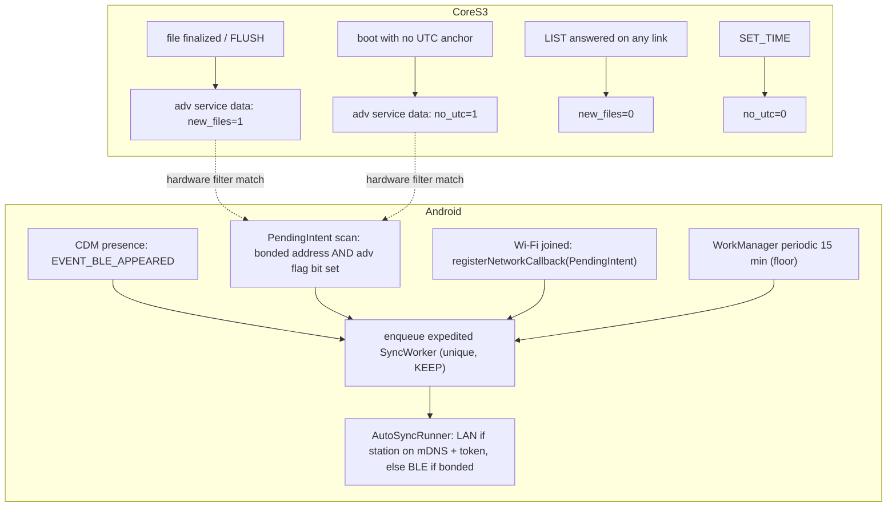

# Background sync triggers: letting the device wake the phone

Design note, **source-checked 2026-09-18; implemented the same day in firmware `-v6.3` (advertising payload) and the Android app (companion presence, Wi-Fi arrival); nothing on this page is bench-verified yet** — the flag-scan receiver on the phone is still to write. Load when working on Auto-sync in the Android app (`../m5stack-aq-android`, `docs/background-sync.md`) or on the firmware's BLE advertising. The GATT/LAN contract, including the advertising bytes, is in [ble-sync-protocol](ble-sync-protocol.md#advertising-payload-v21); this page is the reasoning for *when* a sync starts, not *how* files move.

## Where we are

Today the phone **polls**: a WorkManager periodic request every 15 min (the platform minimum, later under Doze) browses mDNS for up to 10 s, tries LAN, then a direct `connectGatt` to the bonded address. The device does nothing to help — it advertises `AQ-xxxx` plus the service UUID and waits. Measured consequences ([bench-verified](bench-verified.md#board-1-phone-over-lan-and-ble)):

- a file finalizes every 10–60 min and waits up to a period (plus Doze deferral) before the phone learns of it;
- a rebooted device runs **unsynced** (rows into the `unsynced` tree) until the next poll happens to find it, even with the phone on the desk beside it;
- Android destroyed the app's TCP sockets ~2 min after screen-off ("Destroyed live tcp sockets for uids=…"), which is the background-network restriction, not the link; the `dataSync` foreground service is a workaround, and `setForeground` is refused when the worker starts in the background.

Nothing here needs a server; every mechanism below is phone-local and works with no internet, so it stays inside the offline-first rule.

## What Android offers (verified against the API 36/37 SDK jars and AOSP `android16-release`)

| Mechanism | API | Wakes a dead process? | What it needs from the device |
| --- | --- | --- | --- |
| **Companion Device Manager** presence: `CompanionDeviceManager.associate(AssociationRequest{BluetoothLeDeviceFilter})` once, then `startObservingDevicePresence(ObservingDevicePresenceRequest{associationId})` (API 36; `startObservingDevicePresence(String address)` API 31–35, deprecated in 36). The system binds the app's `CompanionDeviceService` and calls `onDevicePresenceEvent(DevicePresenceEvent)` with `EVENT_BLE_APPEARED` / `EVENT_BLE_DISAPPEARED` / `EVENT_BT_CONNECTED` / `EVENT_BT_DISCONNECTED` (API 36; `onDeviceAppeared/Disappeared` API 31–35). | 31+, best on 36 | **Yes** — the system scans, the app is bound when the device is seen | A **stable BLE address**: AOSP's `BleDeviceProcessor` filters with `ScanFilter.setDeviceAddress(mac)` only, `SCAN_MODE_LOW_POWER`, `CALLBACK_TYPE_FIRST_MATCH \| MATCH_LOST`; `EVENT_BLE_DISAPPEARED` is scheduled 10 s after the last report. Advertising payload is irrelevant. |
| CDM **exemptions** while an associated device is present: with `REQUEST_COMPANION_RUN_IN_BACKGROUND` the package goes on the **permanent power-save allowlist**; with `REQUEST_COMPANION_USE_DATA_IN_BACKGROUND` it gets `POLICY_ALLOW_METERED_BACKGROUND`; `REQUEST_COMPANION_START_FOREGROUND_SERVICES_FROM_BACKGROUND` (API 33) lets it start a foreground service from the background. All are normal (install-time) permissions. Source: `CompanionExemptionProcessor.exemptPackageAsSystem`. | 26+/33+ | — | Same as above: presence is what switches the exemption on and off. |
| **Offloaded BLE scan with a `PendingIntent`**: `BluetoothLeScanner.startScan(List<ScanFilter>, ScanSettings, PendingIntent)` (API 26). Filters can combine `setDeviceAddress` with `setServiceData(uuid, data, mask)` or `setAdvertisingDataTypeWithData(type, data, mask)` (API 33); `CALLBACK_TYPE_FIRST_MATCH` needs `BluetoothAdapter.isOffloadedFilteringSupported()`. Since Android 8.1 unfiltered background scans are suppressed with the screen off; filtered `PendingIntent` scans are the sanctioned path. Registrations do not survive a Bluetooth toggle or reboot (re-register on `BOOT_COMPLETED` / `ACTION_STATE_CHANGED`). | 26+ | **Yes** — a `BroadcastReceiver` runs, then enqueues work | Whatever bytes the filter should match: this is the only channel through which **the device can encode "I have something new"** so the phone's controller wakes the app on a bit flip and not merely on proximity. |
| **Wi-Fi arrival**: `ConnectivityManager.registerNetworkCallback(NetworkRequest{TRANSPORT_WIFI}, PendingIntent)` (API 23), or WorkManager 2.8+ `Constraints.setRequiredNetworkRequest(NetworkRequest, NetworkType)` (API 28+) on a one-time request. | 23+ | **Yes** | Nothing. SSID/BSSID are location-gated, so the phone cannot know it is *home*; it browses `_aqsync._tcp` for ≤ 10 s and gives up if the station is absent. |
| WorkManager periodic (current) | — | Yes, every ≥ 15 min, deferred in Doze | Nothing. Keep as the floor. |

Not viable: a device-initiated TCP/UDP "wake" (Android has nothing that wakes a process on an inbound LAN packet; the phone runs no server), a device SoftAP joined via `WifiNetworkSpecifier` (foreground-only, user dialog) or `WifiNetworkSuggestion` (a network without internet is deprioritised and may be dropped), Wi-Fi Aware (no CoreS3 support). A phone that stays GATT-connected all day would receive `status` notifications, but it stops the device advertising, blocks the laptop and every other phone (one BLE connection), and needs the CDM exemption anyway — not the default.

## Proposed layering

1. **CDM association** (app only; no firmware change). Turns proximity into an event and, more importantly, buys the background exemptions that the measured socket kills call for. Replace nothing: the periodic request stays as the floor. `EVENT_BLE_APPEARED` → same expedited `SyncWorker` path as "Sync now in background", so all the existing guards (interactive session wins, no pairing, one link at a time) apply. `EVENT_BLE_DISAPPEARED` → no action (the worker's own timeouts handle a device that walked away mid-transfer). Association needs a one-time system dialog; use `setSingleDevice(true)` with a `BluetoothLeDeviceFilter` on the service UUID so it shows one confirm, not a chooser. Associate at first pair; store `associationId` next to the bond in `known_device`.
2. **Device-flagged wake** (firmware + protocol + app). Advertising service data, below, plus a `PendingIntent` scan whose filters are `deviceAddress = bonded MAC` **and** `serviceData(uuid, 0b01, mask 0b01)` (or `0b10/0b10`; two filters, OR'd). `FIRST_MATCH` fires when the device flips a bit, `MATCH_LOST` re-arms it after the device clears the bit. The receiver checks the counters and enqueues the worker only when `boot`/`fin` differ from what the archive recorded — no connect when nothing changed. Falls back to a plain 15-min poll on a controller without offloaded filtering.
3. **Wi-Fi arrival** (app only). Cheap "came home" trigger for the LAN path; bounded by the existing 10 s mDNS browse.

## Firmware: what actually helps

Implemented in `ble_sync.{h,cpp}` / `telemetry_logger.cpp` (firmware `-v6.3`, builds and lints; not yet flashed). The normative byte layout is in the [protocol](ble-sync-protocol.md#advertising-payload-v21); the reasoning is kept here.

### Advertising payload (protocol v2.1)

Legacy advertising has 31 bytes. Before 2.1 the ADV PDU carried flags (3) + complete 128-bit service UUID list (18); the name rode in the scan response. A 128-bit **service data** AD costs 2 + 16 + payload, so it does not fit beside the UUID list. The split:

| PDU | Contents | Bytes |
| --- | --- | --- |
| ADV | flags · service data (`0x21`, UUID = service UUID `c0a5e9f0-0001-…`, payload ≤ 10) | 3 + 18 + ≤ 10 ≤ 31 |
| SCAN_RSP | complete local name `AQ-xxxx` · complete 128-bit service UUID list | 9 + 18 = 27 |

Payload, little-endian, all fields present from byte 0 so a mask can address them:

| Offset | Field | Meaning |
| --- | --- | --- |
| 0 | `ver` u8 | advertising payload version, `1` |
| 1 | `flags` u8 | bit 0 `no_utc` (no UTC anchor this boot: rows are landing in `unsynced`) · bit 1 `new_files` (a file finalized since the last completed `LIST` on any link) · bit 2 `sd` mounted · bit 3 `lan` (Wi-Fi connected and `lan.on`, so a woken phone knows whether the 10 s mDNS browse is worth it) · bit 4 `fail` (storage worker stopped) · bit 5 `clk_restored` (`clk == 2`: dated from the RTC, a refresh is welcome but not urgent) |
| 2–5 | `fin` u32 | files finalized this boot, same counter as `status.fin` |
| 6–7 | `boot16` u16 | low 16 bits of the boot id, so the phone sees a reboot (`fin` restarts at 0) |
| 8–9 | spare | reserved; **not** an IP address (see security) |

Rules: `new_files` is set when a window closes or a `FLUSH` finalizes, cleared when a `LIST` has been answered on any link (the phone that listed now knows; a phone that then fails its download is covered by the periodic floor). `no_utc` is `status.utc == 0`. v1/v2 phones ignore service data, so this is backward compatible; the change is that they must accept the UUID list arriving in the scan response. Android merges ADV and SCAN_RSP into one `ScanRecord` for software matching, `tools/ble_sync.py` (bleak) sees the same merged record, and the offloaded path is per frame: Android's APCF HCI spec says *"every advertisement and related scan response will have to go through all the filters"* ([HCI requirements](https://source.android.com/docs/core/connect/bluetooth/hci_requirements)), so a UUID filter matches the scan-response frame and a service-data filter the ADV frame. **Still verify on the phone** that the interactive scan finds the device and that the OnePlus 7 Pro's controller matches a service-data mask (`isOffloadedFilteringSupported()` true is expected, not measured).

NimBLE-Arduino 2.5.1: `NimBLEAdvertisementData::setServiceData` *appends* an AD, so the payload is rebuilt from scratch (`setFlags` + `setServiceData`) and pushed with `NimBLEAdvertising::setAdvertisementData`, which issues `ble_gap_adv_set_data` — legal while legacy advertising is active and while connected (the data is used at the restart on disconnect), so no stop/start cycle and no host-task hop. `ble::publish_advert()` packs flags + counter into one atomic word and only issues the HCI command when it changed; `telemetry::publish_status()` calls it every sample tick and `ble_list()` after clearing `new_files`.

### Advertising interval

Detection latency in `SCAN_MODE_LOW_POWER` (512 ms window every 5.12 s) is set by the device's interval, not the phone's. NimBLE's default (30–60 ms connectable) is fast enough and unchanged; if the interval is ever slowed to save power, keep it ≤ 200 ms for 60 s after any flag flips (`setMinInterval/setMaxInterval`, units 0.625 ms), then relax. The CoreS3 logger is usually USB-powered, so the default fast interval is acceptable.

### Address stability

CDM and the address filter both key on the BLE public address, which NimBLE derives from the ESP32-S3 factory MAC — the same value `device_id` is built from. **Never enable NimBLE privacy/RPA on this device**; it would silently break every presence mechanism above. Recorded in [wireless](cores3-wireless.md) and the protocol.

### Things that do not help

- Putting the device's IP or port in the advertisement so a woken phone can skip mDNS. Advertisements are unauthenticated; a forged one would make the phone hand its LAN bearer token to an attacker's socket. Discovery stays mDNS-only (itself unauthenticated — a v3 challenge/response instead of a bearer token is the real fix, out of scope here). The `lan` *bit* is safe: a forgery costs a 10 s browse.
- Extended advertising (BLE 5, 251 bytes). The S3 can, but offloaded filtering of extended PDUs is uneven across phone controllers; legacy is the safe transport for a wake signal.
- Live PM values in the payload for a connect-less widget. Tempting and cheap (2 spare bytes), but everything in an advertisement is public to anyone in range; decide deliberately, not as a side effect of this change.

## Android side, in the app repo

Implemented (app `docs/background-sync.md`): `CompanionPresence` (association via a one-time system dialog from the Device screen's "Set up wake when nearby", presence observation on the 31–35 and 36 API shapes, `known_device.companionAssociationId`, schema v8), `CompanionPresenceService` (`EVENT_BLE_APPEARED` → the same expedited `SyncWorker` run as "Sync now in background", only for devices with Auto-sync on), `SyncTriggers` (Wi-Fi arrival through `registerNetworkCallback(PendingIntent)`, LAN-only run, 10-minute throttle, re-armed at every process start and after boot), and the four `REQUEST_COMPANION_*` permissions. Every trigger ends in `AutoSyncScheduler`; the "WorkManager + `dataSync`, never a bare thread" rule stands, the triggers only decide *when*. The association dialog needs the device to be **advertising**, so a BLE session is dropped for it and restored afterwards (a LAN session stays).

Still to write: the `PendingIntent` flag scan (`deviceAddress` + `serviceData(uuid, 0x02, mask 0x02)` for `new_files`, and `0x01/0x01` for `no_utc`), its receiver (compare `boot16`/`fin` with the archive before enqueueing), and re-registration after a Bluetooth toggle.

## Measure before believing

Record in [bench-verified](bench-verified.md) with firmware hash, app commit and phone model: (1) time from window close to worker start with CDM alone, with the flag scan, and with the poll floor; (2) whether the OnePlus 7 Pro's controller matches a service-data mask in an offloaded filter and how many filters it accepts; (3) whether screen-off LAN syncs survive with the CDM exemption active (the socket-kill signature is `InetDiagMessage: Destroyed live tcp sockets for uids=`); (4) whether `setForeground` in the worker stops being refused; (5) phone battery over a day with the scan registered versus without. A one-off `EVENT_BLE_APPEARED` on a phone that sat next to the device all day proves the presence path exists, not that files arrive sooner — the flag scan is what changes that.

Sources: [CompanionDeviceService](https://developer.android.com/reference/android/companion/CompanionDeviceService) · [API 36 diff, CompanionDeviceService](https://developer.android.google.cn/sdk/api_diff/36/changes/android.companion.CompanionDeviceService) · [API 36 diff, CompanionDeviceManager](https://developer.android.google.cn/sdk/api_diff/36/changes/android.companion.CompanionDeviceManager) · [Companion device pairing guide](https://developer.android.com/develop/connectivity/bluetooth/companion-device-pairing) · [BLE in the background](https://developer.android.com/develop/connectivity/bluetooth/ble/background) · AOSP `services/companion/.../devicepresence/BleDeviceProcessor.java`, `DevicePresenceProcessor.java`, `CompanionExemptionProcessor.java` (branch `android16-release`) · [Android 16 features](https://developer.android.com/about/versions/16/features) · [WorkManager `Constraints.Builder`](https://developer.android.com/reference/androidx/work/Constraints.Builder) · [NimBLE-Arduino advertising size discussion](https://github.com/h2zero/NimBLE-Arduino/issues/135).
