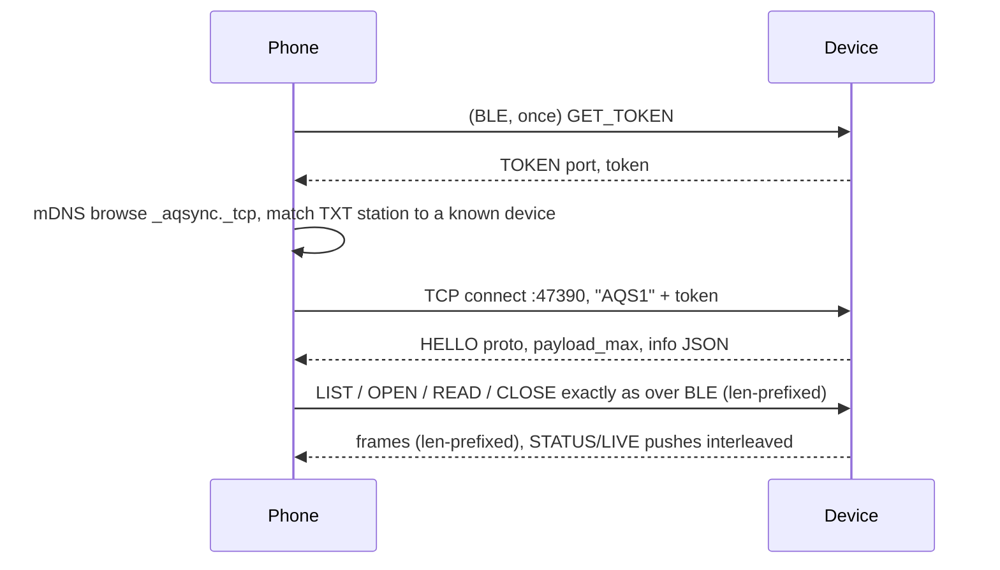

# Sync protocol: device ↔ phone over BLE and LAN

Load when implementing or debugging the Bluetooth LE service, the Wi-Fi/TCP server, or a phone client. Protocol version **2**, defined 2026-09-17; version 1 (2026-09-16, BLE file sync only) is a strict subset, so a v1 phone keeps working against a v2 device. Implemented in the Arduino trial; see [bench-verified](bench-verified.md#board-1-bluetooth-le-sync) for exactly what was measured and on which phone. Radio constraints live in [wireless](cores3-wireless.md); the file/row contract in [telemetry-pipeline](telemetry-pipeline.md).

Version 2 adds, on top of the v1 file sync: **device configuration and control** (`GET_CONFIG`/`SET_CONFIG`, Wi-Fi scan and provisioning, reboot, log tail), **pairing modes** for devices without a screen, and a **LAN transport** — the same frames over one TCP socket, discovered with mDNS, authenticated with a token the phone can only obtain over the bonded BLE link. BLE introduces, LAN accelerates.

## Purpose and non-goals

The system is **offline-first**: the device logs to its card with no network, and the local copy on a phone (or laptop, or another device) is the source of truth. Any link between device and phone — BLE today, Wi-Fi or LoRa device-to-device later — is a sync transport, and if the device or the phone happens to have Wi-Fi or a SIM, that is welcome but never required. Cloud upload, when it exists, is a separate opt-in step that runs *after* local sync and is off by default. This document covers the BLE transport. A phone within Bluetooth range must be able to, without internet or any server:

1. identify the device and its schema,
2. watch the latest readings,
3. give the device UTC once per boot,
4. list every finalized Parquet file on the microSD,
5. copy those files, byte-exact and verified, into the phone's own storage.

The device **never** deletes, rewrites or renames a file because of the phone. Sync is a pull of immutable files; deduplication happens on the phone. There is no SQL, no query pushdown, no row-level API. The phone holds whole files, exactly as the USB-serial `parquet list` / `parquet get` path delivers them today (`tools/export_parquet.py`).

## Transport summary

| Item | Value |
| --- | --- |
| Role | Device = GATT server / peripheral. Phone = central. One connection at a time. |
| Advertising | Connectable, complete 128-bit service UUID below, local name `AQ-xxxx` (`xxxx` = last four hex digits of `device_id`). |
| MTU | Device accepts up to 517. Phone MUST request ≥ 247 before using `control`. Frame sizes derive from the negotiated MTU: `payload_max = min(MTU − 3, 512)`. The 512 cap is the GATT attribute-value limit; Android silently drops notifications above it (measured 2026-09-17), macOS does not, so a device that sends 514-byte frames works from a laptop and fails from a phone. |
| Security | LE Secure Connections, bonding. Pairing mode is configurable (below); the default is chosen at first boot from whether a display is present, the way Meshtastic does it. In `random` and `fixed` modes every characteristic requires an encrypted **and authenticated** link (MITM); in `none` mode encrypted only. After the first bond, reconnects are silent. Unbonding is done on the phone, or with `ble.clear_bonds`; the device keeps up to 3 bonds and evicts the oldest. |
| Endianness | Every multi-byte integer is **little-endian**. |
| Text | UTF-8, no terminator, length implied by frame length. JSON where stated, ASCII-only keys. |

### Pairing modes

| `ble.pair` | Passkey | Default when | Notes |
| --- | --- | --- | --- |
| `random` | fresh 6 digits per attempt, shown on the display and printed on serial (`BLE PAIR passkey=`) | a display is detected at first boot | Physical ownership is proven by reading the screen. This is the v1 behaviour and stays the CoreS3 default. |
| `fixed` | `ble.pin`, default **123456** | no display is detected at first boot (bare ESP32-S3 PCB) | Same phone UX (Android asks for six digits). A known default PIN gives **encryption without meaningful MITM protection** — it stops casual reads, not a determined neighbour. The phone must nag until the default is changed, exactly as Meshtastic warns. |
| `none` | Just Works | never by default | Encrypted, unauthenticated, no prompt. For lab benches only; must be enabled deliberately. Characteristics drop the `AUTHEN` requirement in this mode so reads succeed. |

The mode and PIN are stored in NVS (`aqcfg` namespace) and are **applied at the next boot**, because the NimBLE security parameters are fixed at stack start; `SET_CONFIG` answers with `reboot_required` set and the phone offers `REBOOT`. The first-boot auto-detection result is stored, so removing the display later does not silently change the mode (again like Meshtastic — change the mode before removing the screen). A lost phone is handled by re-pairing or by `ble.clear_bonds=1`.

## Service and characteristics

Base UUID `c0a5e9f0-XXXX-4b1a-9c3e-2d7f8a6b4e01`; the 16-bit field selects the attribute.

| Attribute | UUID | Props | Payload |
| --- | --- | --- | --- |
| **Service** AQ Sync | `c0a5e9f0-0001-4b1a-9c3e-2d7f8a6b4e01` | — | — |
| `info` | `…-0002-…` | read | JSON, ≤ 400 bytes, static for a boot |
| `status` | `…-0003-…` | read, notify | JSON, ≤ 240 bytes |
| `live` | `…-0004-…` | read, notify | JSON, ≤ 240 bytes |
| `control` | `…-0005-…` | write (with response) | binary request, ≤ 512 bytes |
| `response` | `…-0006-…` | notify | binary frames, ≤ `payload_max` (≤ 512) |

`status` and `live` are ≤ 240 bytes so one notification always carries the whole value on MTU ≥ 247. `info` may exceed one PDU; phones use a normal long read. All `response` traffic for one request is emitted in order on the single `response` characteristic, so the phone needs one notification handler and no reassembly beyond concatenating `CHUNK` payloads.

### `info` (read)

```json
{"proto":2,"fw":"cores3-parquet-v6","schema":"cores3-telemetry-v3","cols":77,
 "dict":"<64 hex, SHA-256 of telemetry_fields.inc>","station":"<uuid>",
 "dev":"<12 hex device_id>","boot":"<32 hex boot id>","max_read":16384}
```

`station`, `dev` and `boot` are the same identities written into every Parquet row and Hive path. `max_read` is the largest `length` the device honours per `READ`. `proto` is 2 on firmware that implements this document; a phone that only knows v1 may ignore everything from `0x08` up.

### `status` (read, notify)

Notified after every stored sample (every 10 s) and after any `control` request that changes state.

```json
{"up_s":12345,"int_s":900,"buf":12,"fin":764,"drop":0,"err":0,"miss":0,
 "fail":0,"codec":"LZ4_RAW","utc":1,"gen":1,"clk":2,"rtc":1,"sd":1,
 "sd_kib":31166976,"sd_used_kib":34176,"heap":180000,"part":0,"open":180,
 "open_rg":2}
```

| Key | Meaning |
| --- | --- |
| `up_s` | seconds since boot |
| `int_s` | rotation interval in seconds (600 or 900; firmware v6 adds 1800 and 3600, set over serial only) |
| `buf` | rows buffered in RAM, not yet in any file |
| `open` / `open_rg` | firmware v6: rows and row groups already written and synced into the open `.partial` file whose footer is still pending; they become listable after the window closes or a `FLUSH`. Absent on v5 |
| `fin` / `drop` / `err` / `miss` | same counters as `PARQUET STATUS` and the row fields `files_finalized`, `rows_dropped`, `storage_errors`, `sample_deadlines_missed` |
| `fail` | 1 when the storage worker has stopped writing after an error |
| `utc` / `gen` | 1 when a UTC anchor is set; anchor generation (`clock_epoch`) |
| `clk` / `rtc` | firmware v6.2. `clk` is the anchor source, same codes as `clock_status`: 0 none, 1 host time set on this boot, 2 restored at boot from the RTC (an earlier host sync, whole seconds plus drift). `rtc` is the RTC chip state: 0 not read, 1 in use or written, 2 unusable (absent, voltage-low, invalid calendar). Absent on ≤ v6.1. A phone SHOULD offer "set time" whenever `clk != 1`, not only when `utc == 0`: with `clk == 2` the rows are dated, but nothing has checked that clock against a fresh source since the last sync |
| `sd` | 1 when the card is mounted and the output directory exists |
| `part` | retained `.partial` files seen at the last listing |

### `live` (read, notify)

Notified once per sample. Keys follow the dictionary names in `telemetry_fields.inc`, shortened; absent keys mean **null** (invalid/unavailable), never zero.

```json
{"seq":15021,"mono":150210000000,"utc":1757990410000000000,"pms":4,
 "pm1":5,"pm25":7,"pm10":9,"c1":5,"c25":7,"c10":9,
 "n03":900,"n05":250,"n1":30,"n25":2,"n5":0,"n10":0,
 "t":26.1,"bat":4100,"pct":80,"chg":0,"vbus":5000,"als":120}
```

| Key | Dictionary field |
| --- | --- |
| `seq`, `mono`, `utc` | `sequence`, `monotonic_us`, `event_time_utc_ns` (omitted when unsynchronized) |
| `pms` | `pms_status` code: 0 absent, 1 warming, 2 stale, 3 sensor error, 4 valid |
| `pm1`,`pm25`,`pm10` | `pm*_atmospheric_ug_m3` — the values to display |
| `c1`,`c25`,`c10` | `pm*_cf1_ug_m3` |
| `n03`…`n10` | `particles_gt*_per_01l` |
| `t` | `imu_temperature_c` (board temperature, **not** ambient) |
| `bat`,`pct`,`chg`,`vbus` | `battery_mv`, `battery_percent`, `charging_status`, `vbus_mv` — raw `M5.Power` reports, unqualified; with no battery attached the board has shown `bat` values from 16,372 down to 23 mV with `pct` 0. Display, do not interpret. |
| `als` | `light_ch0_raw` |

PM keys appear only when `pms == 4`. The snapshot is the same row that was queued for storage; it is a display convenience, not a substitute for the stored file.

### `control` (write) and `response` (notify)

First byte is the opcode. Unknown opcode → `ERROR` code 11.

| Op | Name | Request body | Response frames |
| --- | --- | --- | --- |
| `0x01` | `LIST` | — | `FILE` × n, then `LIST_END` |
| `0x02` | `OPEN` | `name` utf8 (rest of packet) | `OPENED` or `ERROR` |
| `0x03` | `READ` | `handle` u16, `offset` u32, `length` u32 | `CHUNK` × n, then `READ_END` |
| `0x04` | `CLOSE` | `handle` u16 | `CLOSED` |
| `0x05` | `SET_TIME` | `epoch_s` i64 | `TIME_SET` or `ERROR` 9; `status` notify |
| `0x06` | `FLUSH` | — | `FLUSHED` or `ERROR` 10; `status` notify |
| `0x07` | `STATUS` | — | `status` notify only; **no `response` frame**, so the phone must not wait on `response` for it. Over LAN this produces a `STATUS` push frame, so it doubles as a keep-alive ping. |
| `0x08` | `GET_CONFIG` | — | `CONFIG` |
| `0x09` | `SET_CONFIG` | `key=value` lines, utf8, `\n`-separated (see [configuration](#device-configuration-v2)) | `CONFIG` or `ERROR` 12 with the offending key as `detail` |
| `0x0A` | `WIFI_SCAN` | — | `WIFI_AP` × n, then `WIFI_SCAN_END`; `ERROR` 15 if the radio cannot scan |
| `0x0B` | `REBOOT` | — | `REBOOTING`, then the device finalizes any RAM batch and restarts |
| `0x0C` | `LOG_TAIL` | `max_bytes` u16 (device clips to its ring size, 8192) | `LOG` × n, then `LOG_END` |
| `0x0D` | `GET_TOKEN` | — | `TOKEN`; **BLE only**, `ERROR` 13 over LAN |

| Frame | Type | Body |
| --- | --- | --- |
| `FILE` | `0x10` | `bytes` u32, `name` utf8 |
| `LIST_END` | `0x11` | `count` u16, `partials` u16, `sd_kib` u32, `sd_used_kib` u32 |
| `OPENED` | `0x20` | `handle` u16, `size` u32, `crc32` u32, `name` utf8 |
| `CHUNK` | `0x21` | `handle` u16, `offset` u32, `payload` (≤ `payload_max − 7`) |
| `READ_END` | `0x22` | `handle` u16, `next_offset` u32, `status` u8 (0 = ok, else error code) |
| `CLOSED` | `0x23` | `handle` u16 |
| `TIME_SET` | `0x30` | `epoch_s` i64, `monotonic_us` i64 |
| `FLUSHED` | `0x31` | `rows` u16 written, `fin` u32 files finalized so far |
| `CONFIG` | `0x40` | `flags` u8 (bit 0 = reboot required for a pending `ble.*` change), JSON ≤ 400 bytes |
| `WIFI_AP` | `0x41` | `rssi` i8, `auth` u8 (0 open, 1 WEP, 2 WPA, 3 WPA2, 4 WPA/WPA2, 5 WPA2-Enterprise, 6 WPA3, 7 WPA2/WPA3, 255 other), `channel` u8, `ssid` utf8 |
| `WIFI_SCAN_END` | `0x42` | `count` u16, `status` u8 (0 ok, else error code) |
| `REBOOTING` | `0x43` | `delay_ms` u16 |
| `LOG` | `0x44` | utf8 text, a slice of the serial log ring in order |
| `LOG_END` | `0x45` | `total` u32 bytes logged since boot, `returned` u16 |
| `TOKEN` | `0x46` | `port` u16, `token` 32 bytes |
| `HELLO` | `0x47` | LAN only: `proto` u8, `payload_max` u16, info JSON (same document as the `info` characteristic) |
| `STATUS` | `0x48` | LAN only, push: status JSON |
| `LIVE` | `0x49` | LAN only, push: live JSON |
| `ERROR` | `0x7F` | `op` u8, `code` u8, `detail` utf8 |

`ERROR.op` echoes the **first byte of the request** as received, even when that byte is not a known opcode (code 11); an empty write is reported as `op=0x01 code=1 detail="empty"`. `OPENED.name` is the requested name in full; the device does not shorten it (names are ≤ 399 bytes, so on an MTU-517 link every `OPENED` fits one PDU — another reason the phone must negotiate 517). A `FILE` entry whose name would not fit `payload_max − 5` is **omitted from LIST** and logged on serial as `BLE LIST SKIP`; `LIST_END.count` counts only entries actually sent. `READ_END.next_offset` always equals `offset + bytes actually delivered in CHUNK frames`; a phone that received fewer bytes has lost a notification and must treat the **window** as failed, never trust `next_offset` over its own count — and a failed window is retried with a new `READ` from the phone's own offset, not an aborted sync. Measured 2026-09-17: an Android phone's Bluetooth stack dropped runs of 16–18 consecutive notifications at the start of a window while the board's Wi-Fi was active (the same windows reached a Mac intact), so clients should keep reading until that request's `READ_END` before re-issuing, and are advised to use ≤ 4 KiB windows over BLE (16 KiB over LAN).

Error codes: 1 malformed request · 2 invalid name · 3 not a finalized Parquet file · 4 open failed · 5 bad handle · 6 range outside file · 7 busy (command queue full or transfer in progress) · 8 storage unavailable · 9 invalid epoch (outside 2020–2100) · 10 nothing to flush · 11 unknown opcode · 12 invalid config (`detail` = key) · 13 not allowed on this link · 14 authentication failed (LAN handshake) · 15 Wi-Fi unavailable.

Rules:

- **Names** are the same relative paths the serial `PARQUET FILE name=` line prints: `station=…/year=…/month=…/day=…/data_HHMM_<boot>_<first>-<last>-<n>.parquet`, `station=…/unsynced/boot=…/…`, `benchmarks/boot=…/…`, or `legacy-parquet/…`. Same character whitelist as `safe_name()` in the firmware: `[0-9a-z._=/-]`, no `..`, no `//`, ends in `.parquet`.
- **`OPEN`** runs the finalized-file check (magic `PAR1` head and tail, footer length sane) and computes the CRC-32 (IEEE, same as the serial `crc32=` field) over the whole file before answering. At most one file is open per connection; a new `OPEN` implicitly closes the previous one. Handles start at 1 and are invalid after disconnect.
- **`READ`** is clipped to `max_read` and to end-of-file. Chunks are delivered in offset order; `next_offset` tells the phone where to continue. Offsets are absolute, so a phone can resume after a disconnect by `OPEN` + `READ` from where it stopped, provided `size` and `crc32` in the new `OPENED` frame match the earlier one (the file is immutable, so they must).
- A file is **complete** only when the phone has `size` bytes, its own CRC-32 equals `OPENED.crc32`, and the head/tail magic is `PAR1`. Anything else is discarded, never presented as data.
- `SET_TIME` uses the device's monotonic clock at the moment the write arrived, the same way `parquet time` does. Only rows sampled afterwards get UTC; earlier rows stay in the `unsynced` tree by contract. The phone should send its own clock only when it believes it is correct, and should say so in its UI. Since firmware v6.2 the value is also written to the BM8563 RTC (UTC) and restored at the next boot as `clk == 2`, so a `SET_TIME` on a device that already reports `utc == 1` is a legitimate *refresh*: it starts a new epoch, and the device logs the skew of the clock it replaced on serial (`PARQUET CLOCK … skew_ms=…`). The `TIME_SET` frame is unchanged; the skew is not returned over the link yet.
- `FLUSH` finalizes the RAM batch — and, on firmware v6, any row groups already in the open file — so the phone can pull everything up to now. Use it deliberately (a "sync now" action); it produces a short file and does not change the rotation interval. The `FLUSHED` row count is RAM rows plus rows that were already on the card in the open file.

## Device configuration (v2)

`GET_CONFIG` returns, and `SET_CONFIG` accepts, the keys below. `SET_CONFIG` is **partial**: only the keys present change. Values are validated as a whole before anything is stored; one bad key rejects the request with `ERROR` 12 and nothing changes. Keys marked *action* are not stored, they do something once. Secrets are write-only: `wifi.psk` is never echoed, `GET_CONFIG` reports `psk_set` instead.

| Key | Value | Applied | Meaning |
| --- | --- | --- | --- |
| `ble.pair` | `random` \| `fixed` \| `none` | next boot | pairing mode, see [pairing modes](#pairing-modes) |
| `ble.pin` | 6 digits `000000`–`999999` | next boot | passkey for `fixed` mode |
| `ble.clear_bonds` | `1` | *action* | forget every bonded phone |
| `wifi.on` | `0` \| `1` | immediately | station radio on/off (off by default) |
| `wifi.ssid` | ≤ 32 bytes | immediately | network name |
| `wifi.psk` | ≤ 63 bytes, empty for an open network | immediately | passphrase, stored in NVS in clear (flash encryption is not used on this board by rule) |
| `lan.on` | `0` \| `1` | immediately | TCP sync server + mDNS while Wi-Fi is connected (on by default) |
| `lan.rotate_token` | `1` | *action* | new LAN token; every LAN session is dropped, phones must fetch the token again over BLE |

```json
{"ble":{"pair":"random","pin":123456,"pin_default":1,"bonds":1,"display":1},
 "wifi":{"on":1,"ssid":"home","psk_set":1,"state":"connected","ip":"192.168.1.42","rssi":-58,"mac":"e0..6b40"},
 "lan":{"on":1,"port":47390,"host":"aq-6b40","clients":0}}
```

`wifi.state` is one of `off`, `connecting`, `connected`, `failed` (wrong passphrase or no such network; the device keeps retrying every 30 s while `wifi.on`). `pin_default` is 1 while `ble.pin` is still 123456, which is the phone's cue to nag. `display` reports what the device detected at boot.

`SET_CONFIG` payload example (one request, three keys):

```
wifi.ssid=home
wifi.psk=correct horse battery staple
wifi.on=1
```

Changing Wi-Fi settings over a LAN session is allowed but will usually drop that session; the phone should do provisioning over BLE. `REBOOT` finalizes the RAM batch first, so no rows are lost; it answers `REBOOTING` with the delay before restart (≈ 500 ms) so the phone can disconnect cleanly.

`LOG_TAIL` returns the newest `max_bytes` of an 8 KiB ring buffer that mirrors everything the firmware prints on serial — the same `PARQUET …` / `BLE …` / `WIFI …` lines a bench log shows. It exists so an advanced user can see why something failed without a USB cable. It is text for humans, not a stable API.

`WIFI_SCAN` runs on the Wi-Fi task, not on the storage worker, and takes 2–4 s; the phone should show progress. Hidden networks are omitted; duplicate SSIDs (several access points) are reported once with the strongest RSSI.

## LAN transport (v2)

The same request bodies and response frames as BLE, carried over **one TCP connection**. Nothing about file sync changes; only the envelope, discovery and authentication differ.

| Item | Value |
| --- | --- |
| Discovery | mDNS/DNS-SD service **`_aqsync._tcp.local.`**, instance = BLE local name (`AQ-xxxx`), host `aq-xxxx.local`, TXT records `proto=2`, `station=<uuid>`, `dev=<12 hex>`, `fw=<firmware id>`. Present only while Wi-Fi is connected and `lan.on`. |
| Port | **47390** (unassigned at IANA; deliberately not Meshtastic's 4403). |
| Framing | Every message in both directions is `len` u16 LE followed by exactly `len` bytes. Phone → device: a control request body (first byte = opcode), ≤ 512 bytes. Device → phone: one response or push frame, ≤ `payload_max` = **1024** bytes, so `CHUNK` carries up to 1017 bytes. |
| Handshake | Within 5 s of connecting the phone sends `"AQS1"` (4 bytes) + `token` (32 bytes), **unframed**. Device answers a framed `HELLO` (proto, `payload_max`, info JSON) or a framed `ERROR` op=0 code 14 and closes. Anything else, or a timeout, closes the socket silently. |
| Sessions | One authenticated client at a time, **newest token holder wins**. A second connection during a session is held aside for the 5 s handshake window: a valid token closes the old session (no frame is sent to it; its pending replies are dropped) and the newcomer receives `HELLO`; a wrong token gets `ERROR` op=0 code 14 and is closed; silence closes it after 5 s. Only while a challenger is already waiting does a third connection receive `ERROR` op=0 code 7. Rationale: Android destroys a backgrounded app's sockets without a FIN, so a phone that comes back would otherwise be locked out until the idle limit. Consequence: a client that auto-reconnects (the Android app does) will take the link back from any other client within seconds, so two phones must not both auto-reconnect to one device. Idle limit: no bytes from the phone for 300 s closes the session; `STATUS` (0x07) is the cheap ping. |
| Pushes | `STATUS` (0x48) and `LIVE` (0x49) frames are pushed on the same socket whenever the device would notify `status`/`live` over BLE. They may arrive **between any two response frames** (the sampling loop does not wait for a transfer); the phone dispatches on the type byte and must not assume `CHUNK`s are contiguous on the wire. Frames are never interleaved *within* a frame — the socket is written under a mutex. |
| Token | 32 random bytes generated at first boot and kept in NVS. Obtainable **only** via `GET_TOKEN` over an authenticated BLE link (`ERROR` 13 over LAN). `lan.rotate_token=1` replaces it. The token is a bearer secret for anyone on the LAN: keep it in app-private storage, never log it. |
| Security | The TCP stream is **not encrypted**; the token authenticates the phone, it does not protect the data from a LAN sniffer. Acceptable for air-quality readings on a home or field network; do not use this for anything you would not print on the device screen. TLS is a possible v3 item, cost unmeasured. |

Sequence for a phone that already bonded over BLE:



The phone should prefer LAN when the device is discovered on the current network and a token is held, fall back to BLE otherwise, and treat both as the same device: archive identity is still `(station, name)`. A LAN session and a BLE session may exist at the same time, but the device still holds **one open file in total**: an `OPEN` on either link implicitly closes the other's, and a handle is only honoured on the link that opened it (`ERROR` 5 elsewhere). Two phones syncing one device concurrently is therefore possible but slow; it is not a goal.

Ownership rules are unchanged: the LAN task never touches the SD card or the display. It parses the envelope, checks the token, and pushes the request body onto the same command queue the BLE and serial paths use; the storage worker answers through the link that asked.

## Ownership on the device

BLE callbacks run on the NimBLE host task. They **never** touch the SD card or the display. A `control` write is converted into a command on the same queue the serial parser feeds; the single storage worker executes it and emits `response`/`status` notifications itself. `live` and `status` notifications after a sample come from the sampling loop, after the row has been queued. This keeps the existing rule: one storage owner, display and SD serialized through the application mutex, 10-second sampling deadline untouched. The 8-deep sample queue gives the worker ~80 s of slack; a `READ` window is capped at `max_read` so one excursion is short even on a slow link.

Notifications can be refused by the host when its buffers are full. The worker retries a bounded number of times with a short delay; a persistent refusal ends the transfer with `READ_END` status 7 rather than skipping a chunk.

## Phone sync algorithm

```mermaid
sequenceDiagram
    participant P as Phone
    participant D as CoreS3
    P->>D: scan for service UUID, connect, MTU 517, bond (passkey on screen)
    P->>D: read info
    P->>D: LIST
    D-->>P: FILE × n, LIST_END
    loop each FILE not already in local archive (station, name, bytes)
        P->>D: OPEN name
        D-->>P: OPENED handle,size,crc32
        loop offset < size
            P->>D: READ handle, offset, max_read
            D-->>P: CHUNK × n, READ_END next_offset
        end
        P->>P: verify size, CRC-32, PAR1 magic; write under original Hive path; record SHA-256
        P->>D: CLOSE handle
    end
```

Local archive identity is `(station, relative name)`; the file is immutable so `bytes` and `crc32` act as a consistency check, and a mismatch is an error to surface, not a version to merge. Store each file at `<archive root>/<station uuid from info>/<relative name verbatim>`. Station files therefore land at `…/<uuid>/station=<uuid>/year=…` — the repetition is intentional: `benchmarks/…` and `legacy-parquet/…` names carry no station of their own, and two devices must never collide. Below the station directory the tree is a drop-in mirror of the SD card and of `tools/export_parquet.py` output.

## Still to measure

Throughput and energy of a full sync over BLE and over LAN, notification-drop and sampling-jitter behaviour with Wi-Fi **on** (coexistence), heap headroom with BLE + Wi-Fi + mDNS + TCP all active, `fixed`/`none` pairing on a display-less board (only simulated on the CoreS3 so far), and bonded-reconnect latency. Record results in [bench-verified](bench-verified.md) with firmware hash and phone model.
