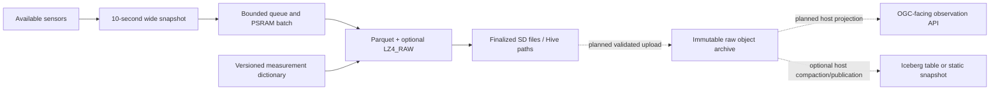
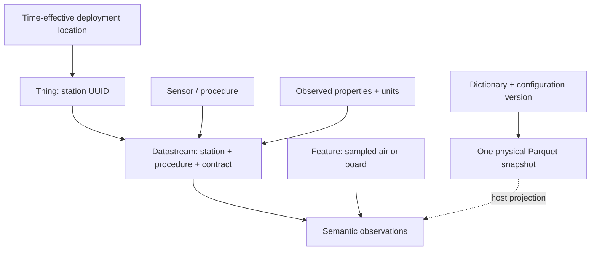

# Table publication and observation semantics

[Router](README.md) · Design/source review **2026-09-08**. This note is not an Iceberg or SensorThings hardware benchmark. The [telemetry pipeline](telemetry-pipeline.md) owns acquisition, SD durability and upload; the [bench record](bench-verified.md) owns measured claims.

## Decision: complementary layers

Keep compressed Parquet with station/date Hive paths as the device's immutable raw archive. Use a versioned measurement dictionary to describe its meaning. Add an OGC-facing adapter or Iceberg table on the host/cloud when a concrete consumer needs it. Neither requires replacing the device's wide numeric snapshot with JSON observations or moving Parquet generation off the device.



Solid arrows describe the device design; dashed arrows are unimplemented downstream work. The dictionary is the firmware change tracked by this note, not part of the earlier benchmark image. The RAM batch is not power-loss recoverable.

| Layer | Responsibility | Decision |
| --- | --- | --- |
| Parquet + LZ4_RAW | Typed measurements, nulls and page compression | Device implementation exists; dated tests apply only to their image/schema |
| Hive directory layout | Human-readable station/UTC grouping and query partition discovery | Preserve current SD/object-key contract |
| Measurement dictionary | Property identity, units, procedure, quality and time semantics | Implement a versioned firmware/host contract |
| SensorThings adapter | Expose observations and linked metadata through a conforming API | Later host/service work, not current compliance |
| Iceberg | Table membership, snapshots and coordinated metadata commits | Later host/cloud experiment |

## Static Iceberg is feasible, not a simpler compression format

PyIceberg `StaticTable` reads a table directly from a metadata location without a running catalog lookup, but does not write it. A publisher must still construct valid metadata and provide a discoverable snapshot. Iceberg's metadata JSON, snapshot manifest list and manifests identify the data files; placing Parquet in a directory does not commit it to the table. Updating a shared table needs safe commit coordination. [StaticTable](https://py.iceberg.apache.org/api/#static-table), [Iceberg specification](https://iceberg.apache.org/spec/)

Device-side metadata generation is conceivable but untested here; it is not rejected as impossible. A host-generated static snapshot is the first useful trial if reproducible dataset publication is needed. A managed cloud table becomes worthwhile for coordinated writers, corrections, snapshot-based queries or schema/partition evolution. Iceberg adds table semantics, not another compression layer, and does not automatically combine small data files.

At uninterrupted 15-minute rotation, one station creates 96 files/day or 35,040/year; 100 stations create 3,504,000/year, before extra splits. File discovery and small-file requests may eventually matter more than byte capacity. Measure query latency/request cost before selecting compaction cadence or table infrastructure.

The current writer emits no Parquet field IDs and no min/max statistics. Station UUID is in the path and file metadata, not a row column; UTC is an INT64 count of nanoseconds, without timestamp annotation. PyIceberg can import some existing files through name mapping, but its partition inference depends on source-column statistics. Do not assume Hive directories automatically populate Iceberg columns. Test compatibility explicitly; host compaction can materialize station identity and typed timestamps in a separate curated table. Do not give Iceberg maintenance ownership of the only raw archive copy: imported files can become eligible for deletion by maintenance. [Existing-file import](https://py.iceberg.apache.org/api/#add-files)

## SensorThings version and useful concepts

The user's V2.0 slide includes multiple ObservedProperties per Datastream, structured `resultType`, optional `resultEncoding`, and Feature/FeatureType with proximate/ultimate feature relationships. The older [linked overview](https://ogc-iot.github.io/ogc-iot-api/datamodel.html) is not a V2 specification. On this review date, the checked [V2 document 23-019](https://hylkevds.github.io/23-019/23-019.html) explicitly labels itself a draft; the [official standards listing](https://www.ogc.org/standards/sensorthings/) lists published Sensing 1.1. Pin a reviewed revision before implementing an API; do not advertise V2 compliance from a metadata dictionary.

Our proposed mapping:

| Concept | Project interpretation |
| --- | --- |
| Thing | Persistent station UUID; hardware MAC remains separate |
| Sensor | Instrument/procedure, with actual replacement and calibration history when known |
| Datastream | Stable measurement contract for a sensor/procedure at a station |
| ObservedProperty | Exact quantity and processing variant; atmospheric PM2.5 is distinct from CF=1 PM2.5 |
| Observation | Sensor result with time, quality and stable identity |
| Location / HistoricalLocation | Deployment geometry and when it applied; unknown until provisioned |
| Feature of interest | What was observed: local air for PM, board for power health; not automatically the station location |

One physical Parquet row can supply several semantic observations. Keep the wide row efficient on SD, and project per-instrument results on the host. Group PMS fields into a structured particle result; IMU and power results retain separate provenance. Device health counters are not ambient environmental observations. A driver/procedure identifier is not a sensor serial number or evidence that an optional accessory was attached.



This is our proposed mapping, not a normative UML/cardinality diagram. In the V2 draft a datastream can describe multiple observed properties; do not infer one sensor or one phenomenon time for every column of our heterogeneous physical row.

## First firmware improvement: bounded provenance and time contract

Implementation scope for this revision:

- A single field dictionary drives column names/types and records procedure group, project-local property URI, unit and validity rule. These URIs are local vocabulary identifiers, not claims of an OGC-controlled vocabulary or hosted resolver.
- Files reference the dictionary by version, source URI and SHA-256, and include a versioned acquisition configuration. Descriptions are not repeated in every row or as a large JSON object in every tiny file.
- Deployment and calibration references remain explicitly unknown. No coordinates, physical sensor serials, battery presence or calibration certification are invented. Provisioning and time-effective deployment history remain future work.
- Append timing columns with a new schema version: snapshot collection completion, most recent valid PMS frame receipt on the device monotonic clock, and the UTC/monotonic anchor used for each row. Unknown anchors and absent PMS frames remain null.
- Snapshot start is not simultaneous physical acquisition across all instruments. PMS receipt is host-side frame availability, not the sensor's internal phenomenon time. Upload/ingestion time must be assigned separately by ingestion, never substituted for measurement time.
- Preserve 10-second monotonic deadlines, validity/nulls, 600/900-second rotation, runtime codec selection, one filesystem owner and immutable finalized files. No new radios, catalog client or OGC HTTP server.

Validate the exact dictionary/schema with host fixtures in both codecs and both readers, check bounded metadata and null/clock behavior, and build the pinned firmware. New file sizes/timings need new board measurements; the previous 73-column compression ratios and offline-capacity arithmetic remain historical baselines, not predictions for an expanded schema. Hardware flashing and readback must be recorded separately from compilation.

### Source implementation and usage

The source revision identifies itself as firmware `arduino-cores3-parquet-v3`, schema `cores3-telemetry-v2` (numeric row value 2), with **77 columns**. The first 73 names/types/order are retained; four nullable INT64 columns are appended. The schema is not SensorThings version 2: these are independent version namespaces. No existing SD file is rewritten.

The single-source [field dictionary](../firmware/arduino-m5unified/bringup/telemetry_fields.inc) drives the enum and physical column descriptors in [the contract](../firmware/arduino-m5unified/bringup/telemetry_contract.h). Its exact source bytes have SHA-256 `20f850852413abb1165f3f7ca95b4831a0e90a34ae7c7fcb41c44b108d3513c3`; both the build and host test reject a stale digest. The source URI contains `main`, which is mutable: retain the matching source revision or dictionary export and verify the digest, rather than trusting the URL alone. The digest covers the `.inc` dictionary, not the entire firmware or all driver behavior.

Each new file carries `dictionary_version`, `dictionary_uri`, `dictionary_sha256`, `acquisition_config_id`, `acquisition_config`, `deployment_id`, `calibration_id`, `time_semantics` and `rotation_interval_s`, alongside existing identity/codec metadata. The acquisition configuration describes selected settings, not a complete hardware register dump or proof of a successful sensor initialization. Runtime rotation and compression are recorded separately. Metadata `unknown` is an explicit sentinel, not an actual deployment/calibration identifier. Host adapters must translate it to missing context, not join all unknown deployments together.

```sh
pixi run telemetry-contract-test --sanitize
# Optional JSON export; parent must exist, destination must not already exist.
pixi run telemetry-contract-test --dictionary-out firmware/arduino-m5unified/artifacts/dictionary-v2.json
# Read the flashed schema-v2 firmware; does not reset or flush.
pixi run parquet-device command --port <checked-port> 'parquet schema'
```

`parquet schema` emits a BEGIN line, 77 FIELD lines and END; it is a bounded diagnostic, not a SensorThings endpoint. Physical type codes match the writer: 1 = INT32, 2 = INT64, 4 = FLOAT. Property URIs include the exact column name, so CF=1/atmospheric PM and raw/physical quantities cannot be silently conflated. Procedure IDs describe logical code paths; append station/deployment/instrument identity in the later service mapping.

### Timing and validity dictionary

```mermaid
sequenceDiagram
    participant P as PMS UART parser
    participant L as Logger loop
    participant W as Storage worker
    participant C as Future cloud ingestion
    P->>P: Checksum-valid frame received; save monotonic receipt
    L->>L: 10-second deadline; snapshot start and clock anchor
    L->>L: Read available instruments sequentially
    L->>L: Record collection completion
    L->>W: Queue immutable row
    W->>W: Rotate batch; finalize Parquet on SD
    Note over W,C: Upload not implemented; delay can include offline days
    W-->>C: Future upload of finalized bytes
    C->>C: Assign ingestion time separately
```

The clock anchor pair in each row supports auditing the UTC mapping without relying on a later mutable global anchor. It does not fix host truncation, transport delay, oscillator drift or unknown sensor integration time. The receipt timestamp identifies even a stale/error-bearing checksum-valid PMS frame, while its measurement values remain governed by `pms_status`. Collection completion is not a physical phenomenon time or sensor result time. Clock corrections split files using the existing clock-epoch mechanism; unsynced rows remain unsynced.

| Validity token | Meaning in this implementation |
| --- | --- |
| `always` | Populated logger/API status or counter; presence does not establish physical accuracy |
| `clock_anchored` | Host anchor supplied for this row's clock epoch; otherwise null |
| `pms_present` | At least one checksum-valid frame received this boot, including stale/error-bearing frames |
| `pms_valid` | `pms_status=4`: present, beyond boot warm-up, within stale threshold, sensor error zero |
| `accel_fresh_finite`, `gyro_fresh_finite` | Corresponding M5 IMU fresh bit and finite value |
| `mag_fresh` | Corresponding fresh bit; uncalibrated auxiliary raw counts |
| `imu_temperature_read_finite` | Enabled IMU, successful temperature read and finite value; die, not ambient temperature |
| `light_valid`, `proximity_valid` | LTR driver validity booleans after fresh read and channel checks; status also reports shared I/O errors |
| `api_report_unqualified` | M5 API report; not independent proof of battery presence, power flow or accuracy |
| `battery_range_0_100` | API result within 0–100; battery presence remains unqualified |
| `rtc_read_ok` | Successful RTC API read; not a trusted UTC source |
| `touch_present` | Nonzero touch count; first reported point |
| `sd_mounted_cached` | Startup mount succeeded; size values are cached KiB-resolution reports, not hotplug proof |
| `unavailable` | Intentionally null: unsupported battery current or unresolved SHT20 isolation |

The `unit` strings are project labels, not a claim of universal UCUM validity. In particular `g` means standard-gravity multiples here, `deg/s` angular velocity, `count/0.1L` cumulative particle counts per 0.1 litre, and `raw_count` is not lux, distance or magnetic field. Codes/bitmasks/calendar encodings require their documented interpretation.

### Validation status

The 90-row/77-column synthetic contract fixtures pass PyArrow and DuckDB in both UNCOMPRESSED and LZ4_RAW, with anchored and unsynchronized clocks, under ASan/UBSan. Tests cover the compiled dictionary digest, numeric types/order, missing measurements, anchor values, completion/receipt timestamps, immutable earlier rows across a clock correction, and explicit unknown context. These tests exercise the shared contract/writer, not real sensor collection or storage-worker scheduling. The generic writer suite remains separate.

The revision was then flashed with hash verification on **2026-09-08**. Real SD readbacks passed for three unsynchronized UNCOMPRESSED rows and four host-anchored LZ4 rows. Column/dictionary metadata, null anchors before synchronization, exact UTC mapping after synchronization, receipt/start/completion order and zero stored health errors were checked. `parquet schema` completed on the board. The logger was left at 15-minute rotation with LZ4 and host UTC restored. These are smoke tests, not full-window endurance, calibrated time accuracy or SensorThings/Iceberg compliance. [Artifact identities, timings and measured scope](bench-verified.md#board-1-schema-v2-provenance-and-timing)
