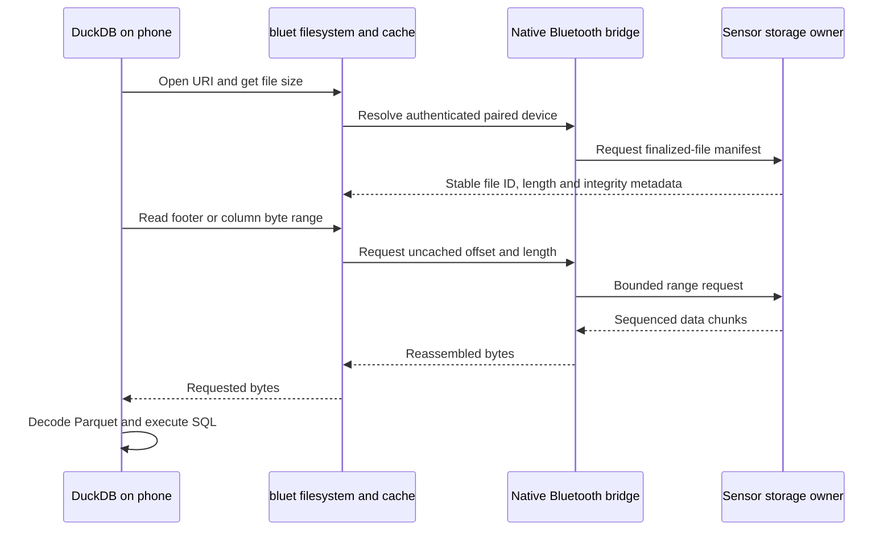

# Idea: query sensor Parquet over Bluetooth

[App workflows](mobile-app.md) · [Architecture](mobile-architecture.md) · **Experimental proposal**, 2026-09-10

[Reviewed extension examples](duckdb-extension-review.md): native file selection and OpenDAL's DuckDB filesystem adapter, with source-pinned findings.

A DuckDB filesystem extension could expose sensor SD files through a custom `bluet://` URI. **DuckDB runs on the phone or hub; the sensor serves file bytes.** No internet or SQL engine on the MCU is required.

## Intended experience

Illustrative SQL only — this scheme and extension do not exist in this project:

```sql
SELECT count(*)
FROM read_parquet(
  'bluet://sensor-id/output/station=example/year=2026/month=09/day=10/time.parquet'
);
```

`sensor-id` is a private pairing alias, not a public MAC address. The remaining path identifies a finalized file from the device manifest; names above are placeholders.

## How it could work



All steps are proposed. Bluetooth needs an application file protocol; it does not automatically expose the SD card as a filesystem.

## Start simple, then measure

| Mode | Behavior | Tradeoff |
| --- | --- | --- |
| Download then query | Fetch complete immutable files; query local paths | Simplest baseline; repeat queries work after disconnect |
| URI with whole-file cache | First open fetches the file; DuckDB reads cached bytes | Same convenient URI without repeated Bluetooth seeks |
| URI with range reads | Fetch footer and requested column ranges; coalesce/cache reads | May transfer fewer bytes, but extra round trips can cost more |

**Prototype whole-file caching first.** Current files are small; selective reads may not beat one transfer. Compare cold/warm query latency, bytes, round trips, memory, energy and sampling drops on both mobile platforms. Current writer lacks min/max statistics, limiting data-page skipping; column projection can still be useful.

## Required contracts

- Filesystem adapter: open, size, offset reads, close and manifest-backed listing. Add glob support only when enumeration is defined.
- Sensor protocol: immutable file ID, offset/length, request ID, chunk sequence, flow control, integrity, timeout, cancellation and reconnect/resume.
- Cache: key by authenticated device plus immutable content identity; never combine bytes from different file versions. Whole-file hash validation needs the whole file; partial verification needs an authenticated chunk scheme.
- Ownership: serve only authorized finalized files through the existing storage worker. Bound requests so logging deadlines and shared SD/display access remain safe.
- Mobile bridge: connect native asynchronous Bluetooth callbacks to DuckDB worker threads; never block the UI or Bluetooth callback thread. Package compatible extension code with each mobile build; runtime extension installation is not assumed.
- Failure: return an explicit unavailable/interrupted query unless all required bytes are cached. No incomplete results presented as complete.

## Acceptance experiment

1. Pair one device and retrieve one manifest/file over Bluetooth.
2. Query through a `bluet://` adapter using a full-file cache; compare results with the same local file.
3. Test disconnect, retry, invalid ranges, corruption and unauthorized access.
4. Add range reads only to compare against that baseline.
5. Confirm logging cadence, drop counters and storage ownership remain correct during queries.

This is **transport-backed local SQL**, not computation pushed onto the sensor. It can later share the same file protocol with Wi-Fi adapters.

## Technical basis

DuckDB already supports [filesystem extensions such as Azure](https://www.duckdb.org/docs/lts/core_extensions/azure) and [Parquet projection/filter pushdown](https://duckdb.org/docs/stable/data/parquet/overview). [Bluetooth GATT](https://www.bluetooth.com/wp-content/uploads/Files/Specification/HTML/Core-61/out/en/host/generic-attribute-profile--gatt-.html) supplies attribute-based transport, not the file protocol above. Together these support the architecture as an engineering inference; they do not prove a working mobile Bluetooth extension.
