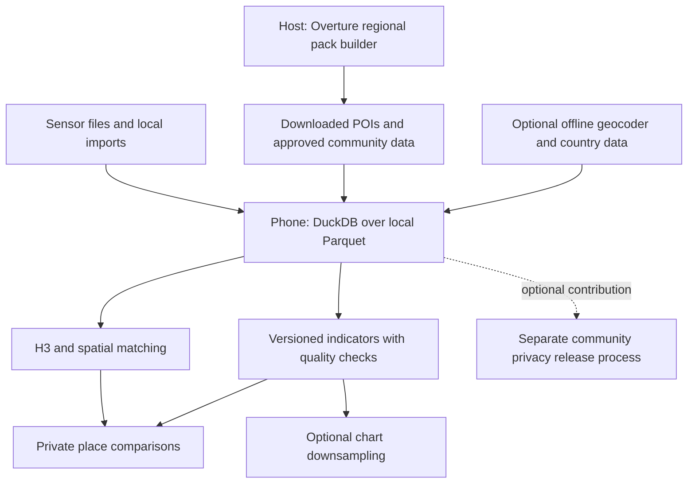
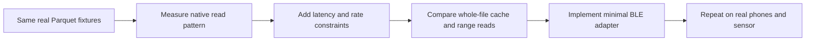

# Community extensions: shortlist for Walkthru.Earth

[App](mobile-app.md) · [Architecture](mobile-architecture.md) · [Bluetooth](bluetooth-parquet.md) · [Filesystem source review](duckdb-extension-review.md)

**Review: 2026-09-10.** Screened all **335 registry descriptions**, with focused metadata and upstream documentation/source checks for relevant candidates. Three parallel reviews covered places, filesystem access and privacy/analytics. This is a shortlist, not 335 implementation audits.

Snapshot: [community-extensions `bad2397`](https://github.com/duckdb/community-extensions/tree/bad23978ec765e3153f22abdb29e2a8c37159707/extensions). Links below identify registry records with upstream source refs. The [published list](https://duckdb.org/community_extensions/list_of_extensions) covers the current stable release; registry presence alone does not establish release availability. No extensions were installed, built or tested on phones.

## Best fits

| Candidate | Concrete use | Decision / limitation |
| --- | --- | --- |
| [h3](https://github.com/duckdb/community-extensions/blob/bad23978ec765e3153f22abdb29e2a8c37159707/extensions/h3/description.yml) | Local cell assignment, neighbors and spatial aggregation | **First candidate.** H3 does not provide anonymity or exact neighborhood boundaries. |
| [gridpin_ext](https://github.com/duckdb/community-extensions/blob/bad23978ec765e3153f22abdb29e2a8c37159707/extensions/gridpin_ext/description.yml) | Offline address search and reverse geocoding | Evaluate for supported pilot countries; requires downloaded country data and per-dataset licenses. Registry lists France, Italy, Netherlands and Serbia; Egypt coverage is not established. |
| [overture](https://github.com/duckdb/community-extensions/blob/bad23978ec765e3153f22abdb29e2a8c37159707/extensions/overture/description.yml) | Build regional POI/address packs and normalize categories | **Pack-building reference.** Reader/geocoder helpers use remote data by default; download/materialize before offline use. Its degree-grid tiling is not H3. |
| [lttb](https://github.com/duckdb/community-extensions/blob/bad23978ec765e3153f22abdb29e2a8c37159707/extensions/lttb/description.yml) | Reduce thousands of history points for a phone chart | Evaluate for rendering only. Compute indicators from qualified observations, not visually downsampled points. |
| [json_schema](https://github.com/duckdb/community-extensions/blob/bad23978ec765e3153f22abdb29e2a8c37159707/extensions/json_schema/description.yml) | Validate manifests, configuration and exported dictionaries | Useful if these use JSON Schema; does not validate Parquet values or measurement semantics. |
| [dq](https://github.com/duckdb/community-extensions/blob/bad23978ec765e3153f22abdb29e2a8c37159707/extensions/dq/description.yml) | Repeatable data-quality assertions and reports | Start on host/hub. Existing SQL and telemetry contract checks may already cover the first app. |
| [datasketches](https://github.com/duckdb/community-extensions/blob/bad23978ec765e3153f22abdb29e2a8c37159707/extensions/datasketches/description.yml) | Compact mergeable quantile/distinct summaries over large histories | Later optimization; approximate counts/sketches are not anonymity or proof of independent contributors. |
| [observefs](https://github.com/duckdb/community-extensions/blob/bad23978ec765e3153f22abdb29e2a8c37159707/extensions/observefs/description.yml) | Measure read sizes, counts and latency through a filesystem wrapper | **Prototype tool.** Determine what DuckDB actually requests before designing BLE range reads. |
| [latency_injection_fs](https://github.com/duckdb/community-extensions/blob/bad23978ec765e3153f22abdb29e2a8c37159707/extensions/latency_injection_fs/description.yml) + [rate_limit_fs](https://github.com/duckdb/community-extensions/blob/bad23978ec765e3153f22abdb29e2a8c37159707/extensions/rate_limit_fs/description.yml) | Simulate delayed reads and restrict byte/operation rates | **Prototype tools.** Useful comparisons; do not reproduce pairing, disconnects, radio contention or real power use. |
| [cache_httpfs](https://github.com/duckdb/community-extensions/blob/bad23978ec765e3153f22abdb29e2a8c37159707/extensions/cache_httpfs/description.yml) | Reuse remote metadata and file blocks | Candidate for public packs or custom FS; mobile/BLE composition unproven. Default block size can amplify reads of our small files. |
| [dryrun](https://github.com/duckdb/community-extensions/blob/bad23978ec765e3153f22abdb29e2a8c37159707/extensions/dryrun/description.yml) | Estimate Parquet bytes before a query | Useful experiment, not a hard transfer/energy limit. Reading metadata can itself cause I/O. |
| [zipfs](https://github.com/duckdb/community-extensions/blob/bad23978ec765e3153f22abdb29e2a8c37159707/extensions/zipfs/description.yml) / [cozip](https://github.com/duckdb/community-extensions/blob/bad23978ec765e3153f22abdb29e2a8c37159707/extensions/cozip/description.yml) | Archive import / indexed-pack design references | `zipfs` reads a selected member fully into memory; `cozip` targets specialized archive profiles. Neither is a default BLE Parquet cache. |

`overture`, `lttb` and `dryrun` were found in the registry but absent from the supplied current-release list. Verify availability for the exact adopted DuckDB build.

## Proposed composition

All extension integrations are proposed. **Core SQL, Parquet and explicit file manifests remain the baseline.** Also assess official [Spatial](https://duckdb.org/docs/current/core_extensions/spatial/overview) for geometry joins and [httpfs](https://duckdb.org/docs/current/core_extensions/httpfs/overview) for optional HTTP/S3 access; they are outside this community list.

## Bluetooth experiment before more firmware work

Use observability → simulation → measured comparison as an experimental sequence, not a claim that every wrapper stacks correctly. Verify wrapper order and compatibility first. Compare cold/warm latency, total transferred bytes, memory and sampling drops. Record real energy separately.

- Cache blocks should suit small immutable files. Keep private caches inside protected app storage.
- A read cache is not a complete verified offline archive. The [reviewed cache implementation's README](https://github.com/dentiny/duck-read-cache-fs/blob/933957df0631fc62d62cb851ece11aa26f72f08a/README.md) documents 1 MiB default blocks and disables DuckDB's external file cache by default; measure the chosen configuration.
- [query_limiter](https://github.com/duckdb/community-extensions/blob/bad23978ec765e3153f22abdb29e2a8c37159707/extensions/query_limiter/description.yml) gates estimated row scans, not actual bytes, memory or execution time. It cannot replace bounded transport and cancellation.
- [hedged_request_fs](https://github.com/duckdb/community-extensions/blob/bad23978ec765e3153f22abdb29e2a8c37159707/extensions/hedged_request_fs/description.yml) duplicates slow requests: possible cloud benefit, poor default for a single constrained BLE sensor.
- [radio](https://github.com/duckdb/community-extensions/blob/bad23978ec765e3153f22abdb29e2a8c37159707/extensions/radio/description.yml) handles event buses such as WebSocket/Redis; its name does **not** mean Bluetooth or ESP-NOW support.
- [opendal](https://github.com/duckdb/community-extensions/blob/bad23978ec765e3153f22abdb29e2a8c37159707/extensions/opendal/description.yml) and [duckdb_opendalfs](https://github.com/duckdb/community-extensions/blob/bad23978ec765e3153f22abdb29e2a8c37159707/extensions/duckdb_opendalfs/description.yml) are separate projects; findings about one do not transfer automatically. The [earlier review](duckdb-extension-review.md) covers the latter.

Focused upstream references: [observefs](https://github.com/dentiny/duckdb-filesystem-observability/blob/5c6fde24e9fa0e3a36d5df291ac8d9414f870b0d/README.md), [delay simulation](https://github.com/dentiny/duckdb-filesystem-latency-injection/blob/88f34426ce0531c48a81773eff566bf94cc2c594/README.md), [rate limits](https://github.com/dentiny/duckdb-rate-limit-filesystem/blob/25f05ab2a8bfe5ecb9af1cc1e44353cfd0d9d07b/README.md), [dryrun estimates](https://github.com/aleda145/duckdb-dryrun/blob/dd1861b2f258644e2d15f880ed1e8b263f004dcc/README.md) and [ZIP memory behavior](https://github.com/isaacbrodsky/duckdb-zipfs/blob/2da467a0e6a71d84fe0e8c628540987c60d1d40a/README.md).

## Worth revisiting after the offline core

| Candidate | Opportunity | Boundary |
| --- | --- | --- |
| [geography](https://github.com/duckdb/community-extensions/blob/bad23978ec765e3153f22abdb29e2a8c37159707/extensions/geography/description.yml) | Spherical geometry when distance/area correctness needs it | Choose deliberately alongside Spatial/H3; no need to adopt several alternative grids now. |
| [valhalla_routing](https://github.com/duckdb/community-extensions/blob/bad23978ec765e3153f22abdb29e2a8c37159707/extensions/valhalla_routing/description.yml) | Local travel-time comparisons using downloaded routing tiles | Upstream labels the extension work in progress; graph storage and mobile integration need testing. POIs alone are not routing data. |
| [semantic_views](https://github.com/duckdb/community-extensions/blob/bad23978ec765e3153f22abdb29e2a8c37159707/extensions/semantic_views/description.yml) | Shared definitions of dimensions, metrics and joins | Could help phone/hub consistency; versioned SQL views/macros are the simpler initial contract. |
| [anofox_forecast](https://github.com/duckdb/community-extensions/blob/bad23978ec765e3153f22abdb29e2a8c37159707/extensions/anofox_forecast/description.yml) / [anofox_statistics](https://github.com/duckdb/community-extensions/blob/bad23978ec765e3153f22abdb29e2a8c37159707/extensions/anofox_statistics/description.yml) / [anofox_tabular](https://github.com/duckdb/community-extensions/blob/bad23978ec765e3153f22abdb29e2a8c37159707/extensions/anofox_tabular/description.yml) | Forecasting, regression and quality tools | Registry declares BSL 1.1. Inspect exact usage grants before commercial embedding; do not assume permissive redistribution. Forecast accuracy needs held-out evaluation. |
| [fit](https://github.com/duckdb/community-extensions/blob/bad23978ec765e3153f22abdb29e2a8c37159707/extensions/fit/description.yml) | User-selected wearable activity imports | Separate opt-in private feature; GPS, heart rate and profiles never enter environmental releases by default. |
| [zim](https://github.com/duckdb/community-extensions/blob/bad23978ec765e3153f22abdb29e2a8c37159707/extensions/zim/description.yml) | Optional offline reference library, repair guides or educational material | Adds content curation, storage and GPL-2.0-or-later dependency considerations; not needed for measurement insights. |
| [ml](https://github.com/duckdb/community-extensions/blob/bad23978ec765e3153f22abdb29e2a8c37159707/extensions/ml/description.yml) / [mlpack](https://github.com/duckdb/community-extensions/blob/bad23978ec765e3153f22abdb29e2a8c37159707/extensions/mlpack/description.yml) / [infera](https://github.com/duckdb/community-extensions/blob/bad23978ec765e3153f22abdb29e2a8c37159707/extensions/infera/description.yml) | Future local inference | Only after an evidence-backed use case, model/data licensing and phone memory/battery measurements. |

## Privacy: investigate, do not assume

Upstream caveats checked separately from registry metadata: [Valhalla work-in-progress status](https://github.com/midwork-finds-jobs/duckdb-valhalla-routing), [Overture helper behavior](https://github.com/cubilica/duckdb-overture), and [forecast usage terms](https://github.com/DataZooDE/anofox-forecast#-license). Current upstream may differ from the registry pin.

[pac](https://github.com/duckdb/community-extensions/blob/bad23978ec765e3153f22abdb29e2a8c37159707/extensions/pac/description.yml) is particularly relevant research: registry v0.2.0 declares privacy units, protected columns and automatic noisy aggregates. Its pinned API uses `PAC_KEY`; current upstream redirects to `cwida/privacy` and documents a changed API. Do not attribute newer upstream privacy modes to the pinned community package.

Evaluate the **person/household privacy unit**, repeated-release composition, linkage, allowed queries, adversary assumptions and utility on our data. PAC privacy is not interchangeable with differential privacy, and adding noise does not establish end-to-end anonymous sharing. The registry declares **AGPL-3.0**; assess the exact adopted revision and distribution model. Compare the pin with [current upstream privacy documentation](https://github.com/cwida/privacy). Keep public sharing gated by the [separate release policy](mobile-architecture.md#community-privacy).

[crypto](https://github.com/duckdb/community-extensions/blob/bad23978ec765e3153f22abdb29e2a8c37159707/extensions/crypto/description.yml) provides hashes/HMAC, not an encrypted-backup/key-recovery system. Hashing station IDs does not anonymize them. Likewise, sketches, H3 cells and table allowlists do not replace a privacy design.

## Adoption rule

**Shortlist first: H3 for product value; filesystem observability/latency/rate controls for the Bluetooth experiment.** Add offline geocoding and chart downsampling when the pilot requires them.

For each adopted extension, pin source and DuckDB compatibility, check license/dependencies, package for the actual iOS/Android targets, and measure offline behavior, binary size, RAM and battery. macOS ARM64 or WASM support does not establish iOS/Android support. An absent exclusion is not a successful mobile test.

Extensions run with the application's privileges; see [DuckDB extension security](https://duckdb.org/docs/current/operations_manual/securing_duckdb/securing_extensions). Ship an approved bundle. Private queries must not silently install extensions, call hosted models, fetch remote macros or emit telemetry.

Other registry groups—enterprise databases, developer tooling, finance, specialist scientific formats and hosted AI—do not solve the present environmental workflow. Revisit only for a concrete feature. No new MCU framework trial is justified by this catalogue.
