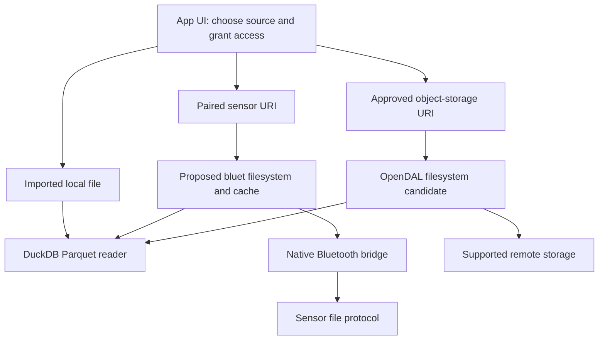

# DuckDB extensions: useful building blocks

[Bluetooth SQL idea](bluetooth-parquet.md) · [App workflows](mobile-app.md) · Source review, 2026-09-10

**Finding:** file selection and file transport are separate layers. These repositories provide useful examples for both; neither implements our mobile Bluetooth filesystem.

For the broader ecosystem, see the [335-entry registry screening and shortlist](community-extension-shortlist.md).

## Reviewed snapshots

| Repository | Reviewed commit | Useful contribution |
| --- | --- | --- |
| [file_dialog](https://github.com/yutannihilation/duckdb-ext-file-dialog/tree/08546d24088402cb9e8bbc36f405e1f48f4b6cce) | `08546d2` | Native file picker exposed as a DuckDB scalar function |
| [duckdb_opendalfs](https://github.com/dentiny/duckdb-opendal-filesystem/tree/6e1479e7b8ed4f95dfe40273560f5227c5464d4c) | `6e1479e` | DuckDB filesystem adapter backed by multiple storage services |

Cloned and reviewed in parallel. No extension build, mobile run or Bluetooth benchmark was performed; dependencies were not installed.

## How they fit

Proposed composition, not an implemented integration. The app handles selection and permissions; DuckDB handles queries after access is established.

## File dialog: useful for import

The [implementation](https://github.com/yutannihilation/duckdb-ext-file-dialog/blob/08546d24088402cb9e8bbc36f405e1f48f4b6cce/src/lib.rs) registers `choose_file()` / `choose_file(extension)`, invokes a native picker and returns a path string. Cancellation returns an error. It does not register a filesystem, transfer bytes or pair devices.

**Use:** a desktop import demo, or inspiration for “choose Parquet → query.” For mobile, keep the picker in the app UI and copy selected content into the validated local archive before querying. Native mobile support is not established by this repository.

[Android document access](https://developer.android.com/training/data-storage/shared/documents-files) uses permission-bearing content URIs; [Apple document access](https://developer.apple.com/library/archive/documentation/FileManagement/Conceptual/DocumentPickerProgrammingGuide/AccessingDocuments/AccessingDocuments.html) can require security-scoped access. Neither should be assumed to yield an unrestricted filesystem path. A file selected from a cloud document provider is not necessarily available offline until copied locally.

## OpenDAL: relevant to transport

| Source finding | Consequence for us |
| --- | --- |
| Registers a DuckDB filesystem subsystem | Concrete example for registering a `bluet://` adapter |
| Implements file size, sequential reads, offset reads and seek | Fits the access pattern needed by Parquet |
| Routes a fixed set of supported URI prefixes | Adding `bluet://` needs code and a backend; changing a URL is insufficient |
| Generic wildcard globbing throws an error | Use manifest-resolved explicit file lists for Hive partitions |
| Uses synchronous OpenDAL C++ bindings backed by Rust | Mobile bridge/threading and cross-compilation still need work |
| Build enables many storage backends | Evaluate a reduced build before adding this dependency to phones |

Sources: [registration](https://github.com/dentiny/duckdb-opendal-filesystem/blob/6e1479e7b8ed4f95dfe40273560f5227c5464d4c/src/duckdb_opendalfs_extension.cpp), [filesystem](https://github.com/dentiny/duckdb-opendal-filesystem/blob/6e1479e7b8ed4f95dfe40273560f5227c5464d4c/src/opendal_file_system.cpp), [URI routing](https://github.com/dentiny/duckdb-opendal-filesystem/blob/6e1479e7b8ed4f95dfe40273560f5227c5464d4c/src/opendal_path.cpp), [build](https://github.com/dentiny/duckdb-opendal-filesystem/blob/6e1479e7b8ed4f95dfe40273560f5227c5464d4c/CMakeLists.txt).

OpenDAL is a candidate for approved public/community file downloads and supported storage services. It does not make encrypted private backups directly queryable or replace a provider's ingestion agreement. Keep remote credentials in the app's protected credential flow.

## Recommended implementation path

1. **Mobile import first:** native picker or Bluetooth download → validated local file → existing DuckDB query.
2. **Small read-only `bluet://` adapter:** use OpenDAL's filesystem shape as a reference, with our native bridge and whole-file cache. Reject writes/deletes; expose only finalized files.
3. **Measure range reads:** compare against complete-file transfer on the actual small Parquet files. Explicit manifest lists precede wildcard support.
4. **Consider a custom OpenDAL backend later:** worthwhile if the same sensor protocol must serve multiple OpenDAL consumers. It adds a Rust/C++/mobile integration boundary and is not supplied by this repo.

The OpenDAL README recommends `cache_httpfs` for caching. Treat that as an optional candidate, not proven Bluetooth compatibility: parallel requests can overwhelm a sensor, and persistent caches need private storage and a defined cleanup policy. Start with bounded requests and an app-owned cache.

**Decision:** borrow the architecture now; do not add either extension as a required dependency until a phone build and end-to-end read justify it.

## Before reusing code

| Repository | Build / reuse constraint |
| --- | --- |
| file_dialog | [Build settings](https://github.com/yutannihilation/duckdb-ext-file-dialog/blob/08546d24088402cb9e8bbc36f405e1f48f4b6cce/Makefile) target DuckDB v1.5.5 with unstable C API enabled. No license file or package license declaration was found in the reviewed snapshot; clarify reuse permission before copying code. |
| duckdb_opendalfs | [MIT license](https://github.com/dentiny/duckdb-opendal-filesystem/blob/6e1479e7b8ed4f95dfe40273560f5227c5464d4c/LICENSE); preserve notices. DuckDB/OpenDAL submodules are commit-pinned, but Rust tracks `stable`. Pin the complete adopted toolchain and verify dependency licenses. Static build support is not evidence of a working mobile package. |
