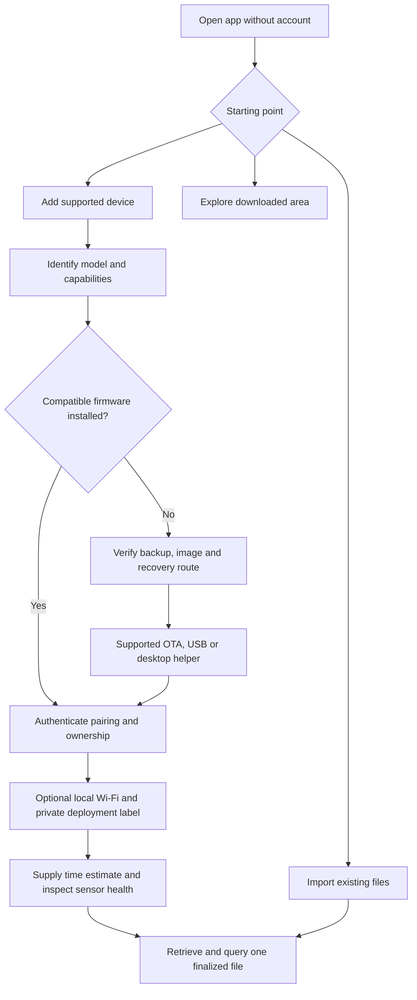
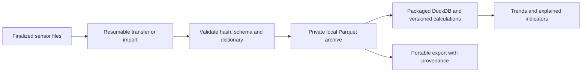
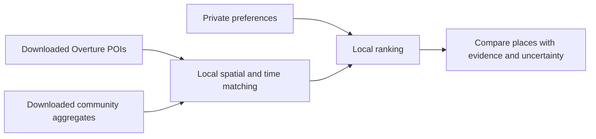
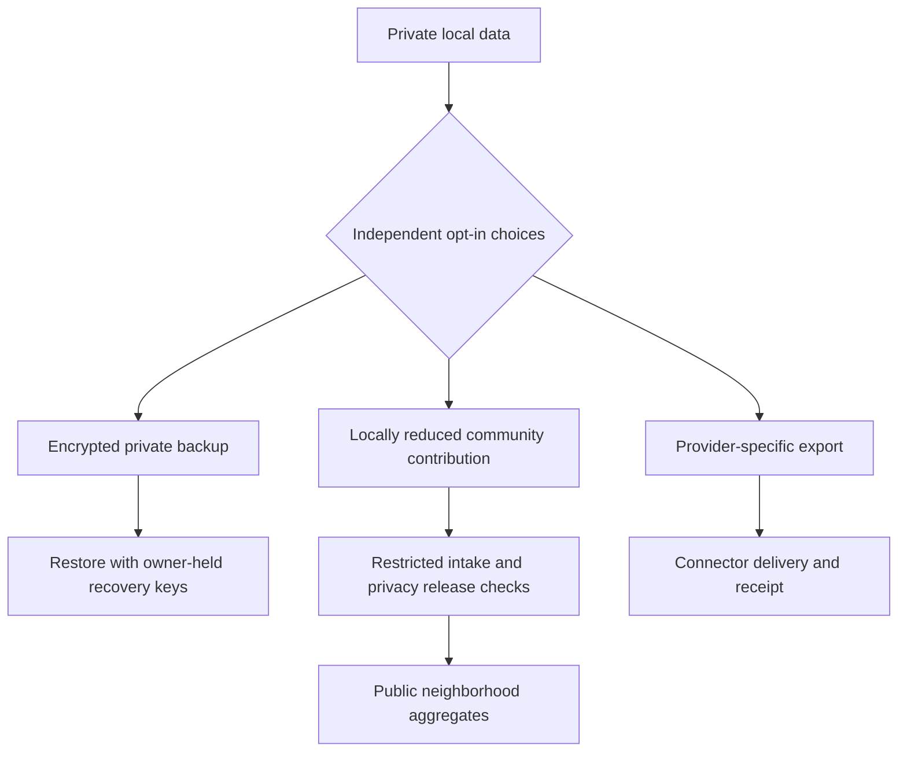

# Mobile app: features and workflows

[Project](../README.md) · [Architecture and privacy](mobile-architecture.md) · [Bluetooth SQL idea](bluetooth-parquet.md) · Proposal, 2026-09-10

**Promise:** understand your environment and find places that suit you, offline. No account required for local use. Sharing is optional and separate from backup.

Visual versions: [selling pitch](ecosystem-pitch.png) · [ecosystem overview](ecosystem-overview.png).

## App areas

| Area | Features |
| --- | --- |
| Today | Measurements, trends, freshness, quality and device health |
| History | Local queries, gaps, source details, indicators and portable export |
| Places | Offline map/list, preferences, comparisons, saved places and evidence |
| Devices | Pair, configure, retrieve files, update, recover and transfer ownership |
| Sharing | Separate backup, community and provider controls; preview and delivery status |
| Settings | Local profiles, accessibility, permissions, storage, recovery and attribution |

Support large text, screen readers, reduced motion and non-color status labels. Preferences such as “quieter” or “lower particle levels” need no diagnosis. Shared-phone profiles stay separate; child profiles default to local use with public sharing disabled. Family access needs explicit, revocable permissions.

## 1. Set up hardware

- Device adapters declare sensors, protocols, update methods and recovery steps. No universal firmware or phone-flashing promise.
- Prefer preconfigured hardware. Updates require model checks, verified images and backups, adequate power and tested recovery. Follow the [CoreS3 safety sequence](../AGENTS.md#do-not-brick-the-board) for this trial; no eFuse writes.
- Pairing requires proof of ownership; a QR label or shared Wi-Fi alone is insufficient. Include lost-phone recovery and credential revocation.
- Location is optional and private, with indoor/outdoor context and effective dates. Unknown location prevents spatial sharing, not logging.

## 2. Retrieve and understand data offline

App processing above is planned. Keep SD originals; deduplicate verified copies. Never query incomplete files, replace missing values with zero or invent UTC. Show stale data, gaps, storage errors and unsynchronized time. Phone background work is best effort; sensor logging continues independently.

Use the phone's native picker and access permissions for imports; see the [extension review](duckdb-extension-review.md) for the distinction between choosing a file and serving it through a filesystem.

Every indicator shows **method, observation window, coverage, freshness and source**. Start with descriptive particle-concentration trends. Named AQI calculations need validated averaging rules. Sound indicators need suitable hardware and calibration; raw microphone amplitude is not dBA. Default acoustic processing retains summaries, not recordings.

## 3. Find suitable places

| Example | Honest result |
| --- | --- |
| Quiet place to study | Rank acoustic evidence; distinguish venue measurements from neighborhood context |
| Prefer lower particulate levels | Compare relevant observations with their age and coverage |
| Little or old data | Show insufficient evidence; missing data never improves a score |

Download selected regions, then query offline. Keep preferences and precise routes local. Preserve Overture release/place identifiers and attribution. POIs, basemap tiles and routing are separate datasets. Neighborhood conditions do not establish indoor venue conditions. Environmental insights do not diagnose people or guarantee health outcomes.

## 4. Choose what leaves the device

Each choice shows a preview, destination, granularity and delivery state. Historical backfill needs explicit selection. Pause stops future transfers; revocation cancels pending work. Explain before publication that public downloads and third-party copies cannot reliably be recalled. Backup never implies publication.

## Delivery order

| Stage | Completion evidence |
| --- | --- |
| Offline core | Real sensor file queried on iOS and Android in airplane mode; independent export works |
| Device ownership | Pairing, update/recovery, interrupted transfers and lost-phone recovery tested |
| Optional backup | Encrypted upload and restore on another phone; owner controls keys |
| Offline places | Regional pack, explained ranking, attribution and sparse/stale-data behavior |
| Community pilot | Defined privacy policy, cohort/abuse checks and repeated-release evaluation |
| One provider | Accepted ingestion contract, consent, retries, deduplication and delivery receipts |

First demo: **sensor → real Parquet file → phone query offline → explained trend → export**. Demonstrate place matching with synthetic or licensed public data before publishing personal contributions.
