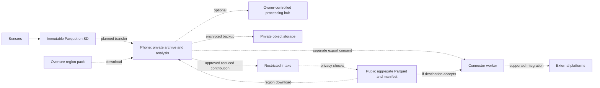
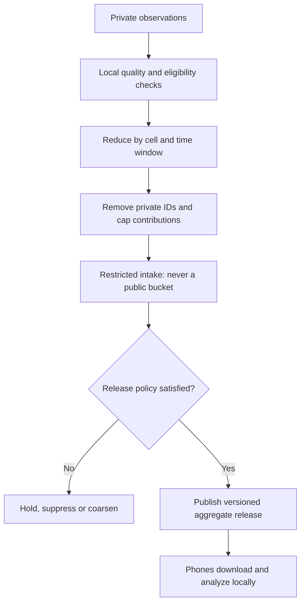
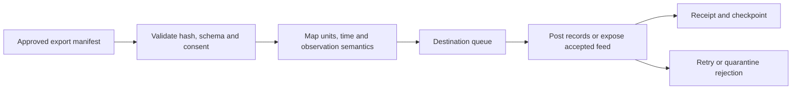

# Mobile ecosystem: architecture and privacy

[Project](../README.md) · [App workflows](mobile-app.md) · [Bluetooth SQL idea](bluetooth-parquet.md) · Proposal, 2026-09-10

**Direction:** open files, local processing, replaceable services. Vendor-independent does not mean dependency-free; the offline core must survive a cloud provider disappearing.

## System

**Solid arrow:** implemented sensor-to-SD path. **Dashed arrows:** proposed work. Existing evidence lives in the [bench record](../docs/bench-verified.md); measurement/file rules remain in the [telemetry pipeline](../docs/telemetry-pipeline.md).

## Compute placement

| Component | Responsibility |
| --- | --- |
| Sensor MCU | Sampling, validity, timestamps, storage; bounded indicators when measured feasible |
| Phone | Default DuckDB queries, preferences, maps, insights and consent |
| Optional inexpensive hub | Larger histories, multiple devices and unattended local work |
| Optional server | Distribution, community release checks and provider connectors |

Start with the phone. Add a hub or MCU analysis after a measured need. No general DuckDB-on-ESP32 capability is assumed. Separate iOS/Android DuckDB PoCs are owner-reported; link exact repositories, commits and real-device results before implementation.

## Data boundaries

| Product | Contents | Rules |
| --- | --- | --- |
| Private raw archive | Original Parquet and private deployment/provenance records | Preserve immutable files and station/UTC Hive contract |
| Private cloud backup | Client-encrypted files and manifest | Owner-held keys; opaque outer names; original Hive paths inside encryption |
| Public release | Approved cell/window statistics, quality, method and license | New allowlisted schema; no private identifiers or paths |

Current raw files contain MAC-derived identity, station UUIDs, boot IDs and timestamps in rows, metadata or paths. They are **not anonymous or encrypted**. H3 and compression do not change that. Phone encryption does not protect the current SD card.

A server cannot expand an end-to-end encrypted backup without the owner's keys. Prefer generating a minimal provider export locally. Keep consent, backup receipts and delivery checkpoints separate from immutable observations.

## Community privacy

- **H3 is a local spatial index**, not a required Uber service, neighborhood boundary or anonymity guarantee.
- One person's aggregate can identify them. A publisher checks independent contributors; one phone cannot establish a neighborhood cohort alone.
- Define spatial/time granularity, contribution caps, coverage, suppression and anti-abuse credentials. Ten sensors in one home do not establish ten independent contributors.
- Evaluate sparse cells, overlapping windows and repeated-release differencing. Thresholds alone do not establish anonymity. Secure aggregation/differential privacy remain options requiring defined trust assumptions and utility tests.
- Intake may observe network metadata and contributor linkage. Document operator access and retention. Regional downloads can also reveal location interests.
- Exclude private indoor observations from outdoor products by default. Never publish health profiles, routes, exact coordinates or stable private IDs.

**Public sharing stays disabled until the policy is specified and evaluated.** Privacy protection is a design objective, not an achieved anonymity claim.

Release fields: release/schema IDs, H3 cell/resolution, UTC window, property/unit, context, statistic/value, coverage/quality, method/privacy-policy versions and source/license. Counts follow the privacy policy too; private lineage stays restricted.

Specify time/station weighting; never blindly average averages. Preserve units, measurement variants and indoor/outdoor boundaries. A cohort result describes contributing sensors, not every resident or venue. It cannot be expanded back into original observations.

## Provider connectors

| Destination | Integration boundary |
| --- | --- |
| AirGradient | Local API works without its cloud. Third-party cloud ingestion for our hardware still needs verification. |
| OpenAQ | Provider-specific ingestion exists; establish an accepted feed. A read API is not an arbitrary upload endpoint. |
| IQAir / AirVisual | One integration family. A suitable unrestricted third-party write API was not verified here. |

Agree metrics, location, averaging, credentials, quotas and licenses per connector. Exact-location publication needs separate consent. Do not represent a cell average as a station at its centroid. If aggregates are unsupported, disable that route or offer a separately consented station export.

Use destination-specific checkpoints, stable export IDs and bounded retries. Exactly-once delivery depends on destination support. Prevent re-export loops and double counting upstream observations. Connector outages never block local use.

## Portability and proof

Version device capabilities, manifests, dictionaries, deployment history, calculations, region packs and export mappings. Bundle query components for offline use. Limit resources for untrusted imports; downloaded packs must not execute arbitrary SQL or load extensions. Authenticate sessions; hashes alone do not authenticate a producer.

| Established here | Still to prove |
| --- | --- |
| CoreS3 writes interoperable SD Parquet | Mobile transport, packaged queries and OS background behavior |
| Scoped LZ4 and schema-v2 readbacks | Production power-loss durability and encrypted sync |
| Nulls, provenance and UTC/unsynced paths | Pairing, recovery and community privacy |
| Open file foundation | Acoustic calibration, useful ranking and accepted connectors |

## Source checks — 2026-09-10

- [AirGradient local API](https://www.airgradient.com/documentation/kb/where-do-i-access-the-api-documentation-api-token-and-local-api) and [sharing](https://www.airgradient.com/documentation/kb/kb-diy-data-ownership-and-sharing): distinguish the complete offline workflow, not a claim that AirGradient always needs cloud.
- [OpenAQ API](https://docs.openaq.org/about/about), [ingestion](https://github.com/openaq/openaq-lcs-fetch) and [terms](https://docs.openaq.org/about/terms): preserve semantics and attribution.
- [IQAir contribution overview](https://www.iqair.com/gb/newsroom/air-pollution-data-collection-movement): public contribution does not establish our write contract.
- [H3](https://h3geo.org/docs/), [Overture Places](https://docs.overturemaps.org/guides/places/) and [attribution](https://docs.overturemaps.org/attribution/): retain release identity and applicable licenses.
